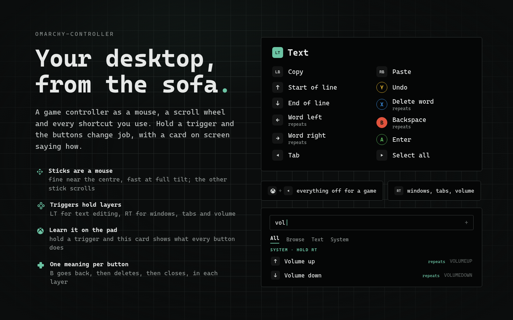
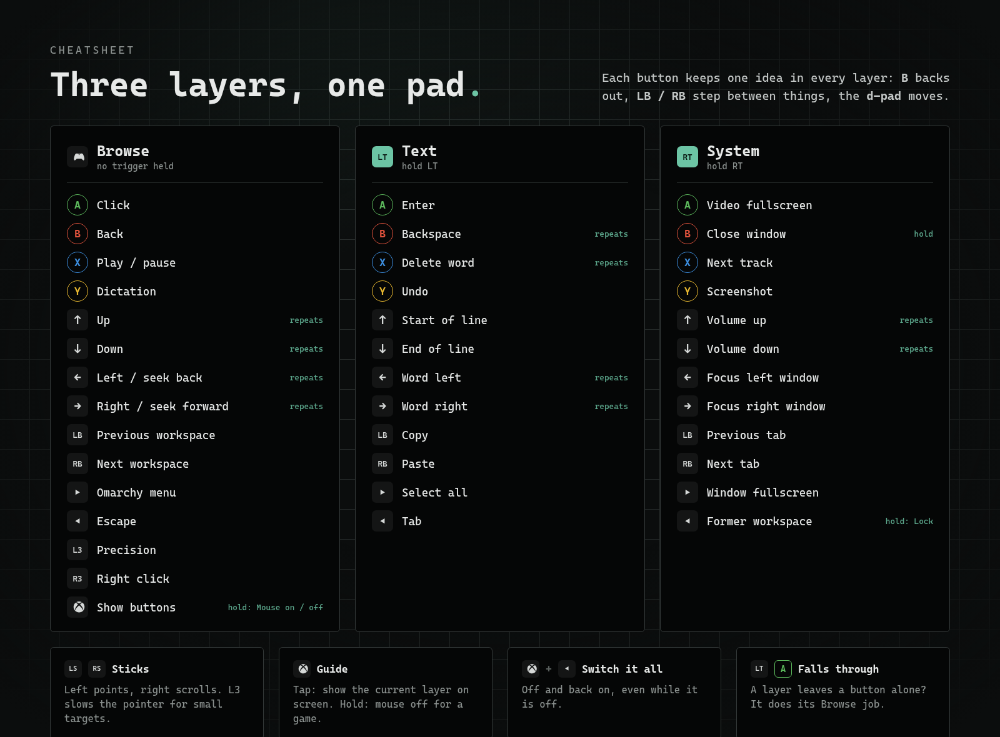

# Controller

Use your [Omarchy](https://omarchy.org) desktop from a game controller, from
bed or the sofa. The sticks are a mouse and a scroll wheel. Hold a trigger and
the buttons change job: the left trigger edits text, the right one handles
windows, tabs and volume. While you hold it, a card on screen shows what every
button now does.



Works with any pad Linux recognises: Xbox, PlayStation, 8BitDo, generic USB
or Bluetooth. Pure Python standard library and QML, so there is nothing to
build.

## The idea

A keyboard has a hundred keys and a pad has about fifteen, so the pad needs
modes. Most controller mappers make you learn chords, combos that live only in
your memory. This plugin uses two ideas:

- **Layers you hold, not chords you remember.** With no trigger held you are
  in *Browse*: point, click, scroll, go back, play and pause. Hold **LT** for
  *Text*, or **RT** for *System*. A layer is active only while its trigger is
  down, so you can never get stuck in the wrong mode.
- **One meaning per button.** Each button keeps a related job in every layer,
  so the layout can be learnt by feel: **B** goes back, then deletes, then
  closes; **LB / RB** step between workspaces, clipboard and tabs; the
  **d-pad** moves the cursor, by word, and between windows.

Then three things make it easy to learn:

- Hold a trigger for a moment and **a card shows that layer's map**, laid out
  as the pad is held. Press a button straight away and it stays out of the way.
- Tap **Guide** (the Xbox button) for the same card, for the layer you are in.
- A button a layer leaves alone **falls through** to its Browse job, so
  clicking and scrolling still work while a trigger is held.

## Cheatsheet



| Button | Browse | Hold LT: Text | Hold RT: System |
|---|---|---|---|
| **A** | Click, hold to drag | Enter | Video fullscreen (`F`) |
| **B** | Back | Backspace, repeats | Close window, on a hold |
| **X** | Play / pause | Delete word, repeats | Next track |
| **Y** | Dictation ([voxtype](https://voxtype.io)) | Undo | Screenshot |
| **D-pad ↑ ↓** | Arrows, repeat | Start / end of line | Volume, repeats |
| **D-pad ← →** | Arrows, repeat (seek a video) | Word left / right | Focus window left / right |
| **LB / RB** | Previous / next workspace | Copy / paste | Previous / next tab |
| **Start** | Omarchy menu | Select all | Window fullscreen |
| **Back** | Escape | Tab | Former workspace; hold to lock |

| | |
|---|---|
| **Left stick** | Move the pointer: a light tilt moves a pixel at a time, full tilt crosses the screen |
| **Right stick** | Scroll, up, down and sideways |
| **L3 / R3** | Precision mode (slower pointer) / right click |
| **Guide** | Tap: show the current layer's card. Hold: mouse off and on, for games |
| **Guide + Back** | Switch the whole controller off and on, even while it is off |

Everything here can be changed in the panel or the config.

## Install

```bash
omarchy plugin add https://github.com/RohitKaushal7/omarchy-controller.git --enable
```

A controller icon appears in the bar. Then give the virtual mouse a flat
acceleration profile, since the plugin applies its own speed curve, by adding
this to `~/.config/hypr/input.lua`:

```lua
hl.device({
  name = "padd-virtual-mouse",
  accel_profile = "flat",
  sensitivity = 0,
})
```

Requirements, all present on a stock Omarchy install:

- Python 3 and the kernel headers package `linux-api-headers` (key codes are
  read from `/usr/include/linux/input-event-codes.h`).
- Read access to `/dev/input` for the pad, and write access to `/dev/uinput`
  for the virtual keyboard and mouse.

`padctl doctor` checks all of it. `padctl` is `bin/padctl` in the plugin
folder.

Optional: Y in Browse runs `voxtype record toggle` for dictation. Without
[voxtype](https://voxtype.io) installed it does nothing;
rebind it in the panel.

## The panel

Click the bar icon.

- **Controller**: the master switch, with the pad shortcut that does the same
  (Guide + Back). Middle-click the bar icon for the same thing.
- **Stick mouse**: the sticks as a mouse, on or off. Right-click the bar icon,
  or hold Guide.
- **Bindings**: start typing to search every binding by button (`rb`,
  `bumper`, `up`), action (`volume`, `copy`), keys (`super+w`) or layer
  (`text`). The tabs pick a layer, and holding a trigger while the panel is
  open shows that layer. A row lights while its button is held and flashes
  when its action runs.

Click a row to edit it, or **+** to add one. A new binding starts by
listening: press the button on the pad, holding a trigger first to put it in
that layer. Then choose:

- **When**: on a tap or on a hold. One button can have both, like Back in
  System: tap for the former workspace, hold to lock.
- **Does**: keys to send (`SUPER+RETURN`), a shell command, a mouse click, or
  a mouse action (on / off, precision).

## Config

Everything lives in `~/.config/dev.reuk.controller/config.json`. The panel
and `padctl` edit it, it can be edited by hand, and changes apply on save.
[The design](docs/specs/2026-10-06-controller-design.md) has the full format
and the rules for layers, taps, holds and repeats.

```bash
padctl list                       # every layer and binding
padctl bind text Y --keys CTRL+SHIFT+Z --label Redo
padctl bind base BACK --hold --keys SUPER+CTRL+L --label Lock
padctl unbind text Y
padctl set mouse.speed 1400       # pixels a second at full tilt
padctl set mouse.curve 2.5        # higher is finer near the centre
padctl set timing.holdMs 400
padctl set toggleCombo '["GUIDE", "START"]'
padctl monitor                    # print buttons as you press them
```

| Setting | Default | |
|---|---|---|
| `mouse.speed` | 1800 | pixels a second at full tilt |
| `mouse.curve` | 2.2 | response curve; 1 is linear |
| `mouse.deadzone` | 0.15 | stick travel ignored around the centre |
| `mouse.scrollSpeed` | 22 | wheel notches a second at full tilt |
| `mouse.precision` | 0.3 | speed while precision mode is on |
| `mouse.naturalScroll` | false | |
| `timing.holdMs` | 450 | how long a hold takes |
| `timing.hintDelayMs` | 350 | how long a trigger is held before its card shows |
| `toggleCombo` | Guide + Back | the on / off combo; `[]` for none |
| `device.match` | any pad | name substrings, to pick one pad of several |
| `device.grab` | false | hide the pad from other apps while this runs |

## IPC

```bash
omarchy-shell dev.reuk.controller status   # JSON
omarchy-shell dev.reuk.controller toggle   # the master switch
omarchy-shell dev.reuk.controller mouse    # the stick mouse
omarchy-shell dev.reuk.controller hint     # the current layer's card
omarchy-shell dev.reuk.controller reload
```

## What it touches

It reads the controller's `/dev/input` node and creates two virtual devices,
`padd virtual keyboard` and `padd virtual mouse`, which go away when the shell
stops. It writes only its own config file, and changes no Hyprland or Omarchy
setting. Games still see the controller unless `device.grab` is on; switch
the plugin off with Guide + Back while you play.

## Development

```bash
tests/run.sh          # daemon, panel logic, qmllint
tools/graphics.py     # rebuild preview.png and docs/cheatsheet.png
```

One test drives the real daemon with a synthetic uinput pad. Its name carries
a marker that a running daemon ignores, so the suite can never type into your
desktop.

## Remove

```bash
omarchy plugin disable dev.reuk.controller
omarchy plugin remove dev.reuk.controller
rm -rf ~/.config/dev.reuk.controller
```

Then delete the `padd-virtual-mouse` block from `~/.config/hypr/input.lua`
if you added it.

## License

[MIT](LICENSE)
